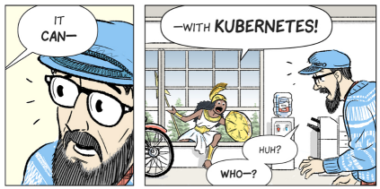

# Sk8s Kubernetes Environment


## Why can't it just work all the time?

[](https://cloud.google.com/kubernetes-engine/kubernetes-comic/)

https://cloud.google.com/kubernetes-engine/kubernetes-comic/


## Interacting with the environment

You can interact with the Kubernetes environment in the following ways - 

* GitHub - commits to master branch are continuously deployed to the relevant environment. See .travis.yaml for the continuous deployment configuration and deployed environments.
* [Google Cloud Shell](https://cloud.google.com/shell/docs/quickstart) - The recommended and easiest way for running management commands. Just setup a Google Cloud account and enable billing (you get 300$ free, you can setup billing alerts to avoid paying by mistake). You can use the cloud shell file editor to edit files, just be sure to configure it to indentation of 2 spaces (not tabs - because they interfere with the yaml files).
* Any modern PC / OS should also work, you will just need to install some basic dependencies like Docker and Google Cloud SDK (possibly more). The main problem with working from local PC is the network connection, if you have a stable, fast connection and know how to install the dependencies, you might be better of running from your own PC.
* Docker + Google Cloud service account - for automation / CI / CD. See the sk8s-ops sub-chart for more details.

Ensure you have permissions on the relevant Google Project. Permissions are personal, so once you authenticate with your google account, you will have all permissions granted for you by the different Google Cloud projects.

To interact with the environment locally, install [Google Cloud SDK](https://cloud.google.com/sdk/) and run `gcloud auth login` to authenticate.

On Google Cloud Shell you are already authenticated and all dependencies are installed.

Clone the relevant repo

```
git clone <K8S_REPO_URL>
```

All following commands should run from the k8s repo root directory

```
cd <CLONED_K8S_REPO_DIRECTORY>
```


## Connect to an existing environment

The main environments should be committed to the k8s repo under `environments` directory

Each directory under `environments` corresponds to an environment name which you can connect to:

```
source switch_environment.sh ENVIRONMENT_NAME
```

Make sure you are connected to the correct environment before running any of the following commands.

See [the environments documentation](/environments/README.md) for more details about environments and how to create a new environment / Kubernetes cluster.


## Releases and deployments

[Helm](https://github.com/kubernetes/helm) manages everything for us.

When deploying to the main, shared environments (e.g. `staging` / `production`), check the following points first:

* The preferred way to deploy is by opening and merging a pull request - this prevents infrastructure deployment risks and is generally more secure.
* If you intend to do some infrastructure development, consider creating your own personal environment and testing on that, it's very easy to replicate an existing environment, see [the environments documentation](/environments/README.md) for details.
* If you want to update an attribute of a specific deployment, see the section below - Patching configuration values without Helm

If you still want to deploy directly, just make sure you are the only one working on the environment and/or update with the master branch to prevent infrastructure conflicts.

Make sure you have the latest helm installed on both client and server: `helm init --upgrade`

Deploy:

```
./helm_upgrade.sh
```

When helm upgrade command completes successfully it doesn't necesarily mean deployment is complete (although it often does) - it only updates the desired state.

Kubernetes / Helm have a desired state of the infrastructure and they will do their best to move to that state.

You can add arguments to `./helm_upgrade.sh` which are forwarded to the underlying `helm upgrade` command.

Check [the Helm documentation](https://docs.helm.sh/) for more details.

Some useful arguments:

* For initial installation you should add `--install`
* Depending on the changes you might need to add `--recreate-pods` or `--force`
* For debugging you can also use `--debug` and `--dry-run`

Additionally, you can to use `force_update.sh` to force an update on a specific deployment.


## Configuration values

The default values are at `values.yaml` at the root of the k8s repo. These are used in the chart template files (under `templates` and `charts` directories)

Each environment can override these values using `environments/ENVIRONMENT_NAME/values.yaml`

Finally, automation scripts write values to `environments/ENVIRONMENT_NAME/values.auto-updated.yaml` using [the helm_update_values.sh script](/helm_update_values.sh).


## Secrets

After updating a secret you should update the affected deployments, you can use `./force_update.sh` to do that

Secrets shoule be optional so you can run the environment without any secretes and will use default values similar to dev environments.

Each environment may include a script to create the environment secrets under `environments/ENVIRONMENT_NAME/secrets.sh` - this file is not committed to Git.


## Patching configuration values using helm_update_values.sh script

The helm_update_values.sh script can be used to update Helm configuration values, usually from automation / CI scripts.

This method works under the following conditions:

* You want to make changes to a main / shared environment, otherwise, just do a helm upgrade.
* You want to modify a specific value in a specific resource (usually a deployment image, but other values are possible too)
* This value is represented in the Helm configuration values

This script accepts a single required argument - a json string containing the required update

It updates the values in the current environment's auto updated values file - environments/ENVIRONMENT_NAME/values.auto-updated.yaml

for example, the following command will update the image value under the spark key.

```
./helm_update_values.sh '{"spark":{"image":"'${IMAGE_TAG}'"}}'
```

Json values require quotes which may interfere with bash scripts, so you can provide it base64 encoded

```
B64_UPDATE_VALUES=`echo '{"spark":{"image":"'${IMAGE_TAG}'"}}' | base64 -w0`
./helm_update_values.sh $B64_UPDATE_VALUES
```

After ther values were updated, they should be pushed to GitHub

It's important to commit the changes to Git **first** and only then patch the deployment - this prevents infrastrcuture conflicts.

This script also supports updating Git from CI tools

Create a [GitHub machine user](https://developer.github.com/v3/guides/managing-deploy-keys/#machine-users) and give this user write permissions to the k8s repo.

Run the script with the full parameters:

```
./helm_update_values.sh <YAML_OVERRIDE_VALUES_JSON> [GIT_COMMIT_MESSAGE] [GIT_REPO_TOKEN] [GIT_REPO_SLUG] [GIT_REPO_BRANCH]
```

Where GIT_REPO_TOKEN is the machine user's token

After GitHub was updated, patch the deployment, for example, in case of image update:

```
kubectl set image deployment/spark spark=${IMAGE_TAG}
```

You can use the following to set the token on travis:

```
travis env set --private K8S_OPS_GITHUB_REPO_TOKEN "*****"
```


## Continuous Deployment

External services / apps can be self-deploying using the above method for patching configurations

The continuous deployment flow is based on:

* Travis - runs the deployment script on each app's repo on commit to master branch (AKA merge of PR).
* Ops Docker (see above) - provides a consistent deployment environment and to securely authenticate with the service account secret.
* GitHub - for persistency of deployment environment values - GitHub maintains the state of the environment. Each app commits deployment updates to the k8s repo.

Install the [Travis CLI](https://github.com/travis-ci/travis.rb#installation)

Enable Travis for the external repo (run `travis enable` from the repo directory)

Copy `.travis.yml` from this repo to the app repo and modify the values / script according to your app requirements

Set the k8s ops service account secret on the app's travis

assuming you have the secret-k8s-ops.json file available at the external app's root directory

```
travis encrypt-file secret-k8s-ops.json secret-k8s-ops.json.enc
```

Copy the `openssl` command output by the above command and modify in the .travis-yml

The -out param should be `-out k8s-ops-secret.json`

Check other sk8s apps for more deployment example, here is a continuous deployment which patches the deployment with help_update_values: https://github.com/OriHoch/sk8s-ops/blob/master/.travis.yml


## Authorize with GitHub to push changes

You can use the following procudure on both Google Cloud Shell and from local PC to enable pushing changes to GitHub

Create an SSH key -

```
[ ! -f .ssh/id_rsa.pub ] && ssh-keygen -t rsa -b 4096 -C "${USER}@cloudshell"
cat ~/.ssh/id_rsa.pub
```

Add the key in github - https://github.com/settings/keys

Clone the repo

```
git clone git@github.com:midburn/midburn-k8s.git
```
